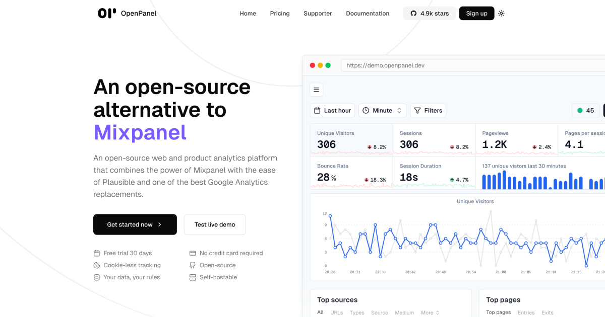

<p align="center">
	<h1 align="center"><b>Openpanel</b></h1>
<p align="center">
    An open-source alternative to Mixpanel
    <br />
    <br />
    <a href="https://openpanel.dev">Website</a>
    ·
    <a href="https://openpanel.dev/docs">Docs</a>
    ·
    <a href="https://dashboard.openpanel.dev">Sign in</a>
    ·
    <a href="https://go.openpanel.dev/discord">Discord</a>
    ·
    <a href="https://twitter.com/OpenPanelDev">X/Twitter</a>
    ·
    <a href="https://twitter.com/CarlLindesvard">Creator</a>
    ·
  </p>
  <br />
  <br />
</p>
  
Openpanel is an open-source web and product analytics platform that combines the power of Mixpanel with the ease of Plausible and one of the best Google Analytics replacements.

## ✨ Features

- **🔍 Advanced Analytics**: Funnels, cohorts, user profiles, and session history
- **📊 Real-time Dashboards**: Live data updates and interactive charts
- **🎯 A/B Testing**: Built-in variant testing with detailed breakdowns
- **🔔 Smart Notifications**: Event and funnel-based alerts
- **🌍 Privacy-First**: Cookieless tracking and GDPR compliance
- **🚀 Developer-Friendly**: Comprehensive SDKs and API access
- **📦 Self-Hosted**: Full control over your data and infrastructure
- **💸 Transparent Pricing**: No hidden costs or usage limits
- **🛠️ Custom Dashboards**: Flexible chart creation and data visualization
- **📱 Multi-Platform**: Web, mobile (iOS/Android), and server-side tracking

## 📊 Analytics Platform Comparison

| Feature                                | OpenPanel | Mixpanel | GA4       | Plausible |
|----------------------------------------|-----------|----------|-----------|-----------|
| ✅ Open-source                         | ✅         | ❌        | ❌        | ✅         |
| 🧩 Self-hosting supported              | ✅         | ❌        | ❌        | ✅         |
| 🔒 Cookieless by default               | ✅         | ❌        | ❌        | ✅         |
| 🔁 Real-time dashboards                | ✅         | ✅        | ❌        | ✅         |
| 🔍 Funnels & cohort analysis           | ✅         | ✅        | ✅*       | ✅***         |
| 👤 User profiles & session history     | ✅         | ✅        | ❌        | ❌         |
| 📈 Custom dashboards & charts          | ✅         | ✅        | ✅        | ❌         |
| 💬 Event & funnel notifications        | ✅         | ✅        | ❌        | ❌         |
| 🌍 GDPR-compliant tracking             | ✅         | ✅        | ❌**      | ✅         |
| 📦 SDKs (Web, Swift, Kotlin, ReactNative) | ✅      | ✅        | ✅        | ❌         |
| 💸 Transparent pricing                 | ✅         | ❌        | ✅*       | ✅         |
| 🚀 Built for developers                | ✅         | ✅        | ❌        | ✅         |
| 🔧 A/B testing & variant breakdowns    | ✅         | ✅        | ❌        | ❌         |

> ✅* GA4 has a free tier but often requires BigQuery (paid) for raw data access.  
> ❌** GA4 has faced GDPR bans in several EU countries due to data transfers to US-based servers.  
> ✅*** Plausible has simple goals

## Stack

- **Nextjs** - the dashboard
- **Fastify** - event api
- **Postgres** - storing basic information
- **Clickhouse** - storing events
- **Redis** - cache layer, pub/sub and queue
- **BullMQ** - queue
- **GroupMQ** - for grouped queue
- **Resend** - email
- **Arctic** - oauth
- **Oslo** - auth
- **tRPC** - api
- **Tailwind** - styling
- **Shadcn** - ui

## Self-hosting

OpenPanel can be self-hosted and we have tried to make it as simple as possible.

You can find the how to [here](https://openpanel.dev/docs/self-hosting/self-hosting)

**Give us a star if you like it!**

[](https://star-history.com/#Openpanel-dev/openpanel&Date)

## Development

### Prerequisites

- Docker
- Docker Compose
- Node
- pnpm

### Start

```bash
pnpm install
cp .env.example .env
echo "API_URL=http://localhost:3333" > apps/start/.env

pnpm dock:up
pnpm codegen
pnpm migrate:deploy # once to setup the db
pnpm dev
```

You can now access the following:

- Dashboard: https://localhost:3000
- API: https://api.localhost:3333
- Bullboard (queue): http://localhost:9999
- `pnpm dock:ch` to access clickhouse terminal
- `pnpm dock:redis` to access redis terminal


# openpanel-app

### MOdificar KUBECONFIG al abrir nuevo terminal

export KUBECONFIG=/etc/rancher/k3s/k3s.yaml


### Creación secrets en github para el pipeline de ci


1. Secretos que NO puedes gestionar con Sealed Secrets
Estos deben seguir en GitHub Secrets, porque el pipeline los necesita para interactuar con servicios externos antes de llegar al clúster:

    secrets.DOCKER_PASSWORD y secrets.DOCKER_USER (para el paso Login Docker Hub): GitHub Actions necesita la contraseña real en texto plano para autenticarse contra los servidores de Docker. Como Sealed Secrets solo puede ser descifrado por tu K3s, GitHub no sabría qué hacer con un archivo sellado aquí.
    secrets.KUBE_CONFIG: Es la llave que permite a GitHub Actions "entrar" en tu servidor Red Hat. No puede estar sellada porque es la herramienta que entrega los sellos.

2. Secretos que SÍ puedes gestionar con Sealed Secrets
Son todos aquellos que tu aplicación (OpenPanel) necesita para funcionar una vez que ya está dentro del clúster K3s:

    Credenciales de Base de Datos: Si tu api o worker necesitan conectarse a una DB, sella esas claves.
    API Keys de terceros: (Ej: Stripe, SendGrid, AWS Keys) que use el código de tu aplicación.
    DOCKER_USER y DOCKER_PASSWORD (solo si la App los usa): Si tu aplicación OpenPanel necesita estas variables internamente para alguna función de su código, entonces sí creas un SealedSecret con ellos para que el pod los consuma.

3. El caso especial: imagePullSecrets
Si tus imágenes de Docker son privadas, K3s necesitará tus credenciales para descargarlas y levantar los pods.

    Aquí SÍ usas Sealed Secrets.
    Cifras tus credenciales de Docker una vez, las subes a Git como SealedSecret, y K3s las usará automáticamente para hacer el pull de la imagen que el pipeline acaba de subir.

Resumen visual de tu Pipeline
Secreto 	        Ubicación	    ¿Se puede sellar?	Razón
Login Docker Hub	GitHub Secrets	      NO	        GitHub necesita la clave real para el push.
Kubeconfig	        GitHub  Secrets	      NO	        Es el acceso al clúster.
Config de la App	Sealed Secrets	      SÍ	        Es seguro en Git y solo K3s lo lee.
imagePullSecrets	Sealed Secrets	      SÍ	        Permite a K3s bajar imágenes privadas.


Como vamos a usar runners locales, no hace falta ca,biar KUBECONFIG para tener una IP pública

En GitHub, en el repo de la app, solo crearemos:

settings → Secrets and variables → Actions → New repository secret

${{ secrets.DOCKER_PASSWORD }}  --> javierfg1
${{ secrets.DOCKER_USER }} --> NeaNao=65


### Crear self-hosted

Ve a tu repositorio en GitHub

Settings → Actions → Runners

Click en New self-hosted runner

Elige tu sistema operativo

GitHub te mostrará comandos personalizados

---Download
# Create a folder

Creamos una carpeta para runners en el repo:
/home/javi/DEVOPS/9_elgransalto/openpanel-repos/openpanel-platform/runners

En esta carpeta hacemos:
mkdir actions-runner && cd actions-runner
# Download the latest runner package
curl -o actions-runner-linux-x64-2.333.1.tar.gz -L https://github.com/actions/runner/releases/download/v2.333.1/actions-runner-linux-x64-2.333.1.tar.gz
# Optional: Validate the hash
echo "18f8f68ed1892854ff2ab1bab4fcaa2f5abeedc98093b6cb13638991725cab74  actions-runner-linux-x64-2.333.1.tar.gz" | shasum -a 256 -c
# Extract the installer

---Configure
# Create the runner and start the configuration experience
./config.sh --url https://github.com/javierfg1/openpanel-app --token BDA6NA4WYFZWRZUUX7JENDLJ4S7V6
# Last step, run it!
./run.sh

---Using your self-hosted runner
# Use this YAML in your workflow file for each job
runs-on: self-hosted


### Comandos ejecutados

[javi@localhost runners]$ mkdir actions-runner && cd actions-runner
[javi@localhost actions-runner]$ pwd
/home/javi/DEVOPS/9_elgransalto/openpanel-repos/openpanel-platform/runners/actions-runner
[javi@localhost actions-runner]$ curl -o actions-runner-linux-x64-2.333.1.tar.gz -L https://github.com/actions/runner/releases/download/v2.333.1/actions-runner-linux-x64-2.333.1.tar.gz
  % Total    % Received % Xferd  Average Speed   Time    Time     Time  Current
                                 Dload  Upload   Total   Spent    Left  Speed
  0     0    0     0    0     0      0      0 --:--:-- --:--:-- --:--:--     0
100  213M  100  213M    0     0  80.2M      0  0:00:02  0:00:02 --:--:--  100M
[javi@localhost actions-runner]$ tar xzf ./actions-runner-linux-x64-2.333.1.tar.gz
[javi@localhost actions-runner]$ ./config.sh --url https://github.com/javierfg1/openpanel-app --token BDA6NA4WYFZWRZUUX7JENDLJ4S7V6

--------------------------------------------------------------------------------
|        ____ _ _   _   _       _          _        _   _                      |
|       / ___(_) |_| | | |_   _| |__      / \   ___| |_(_) ___  _ __  ___      |
|      | |  _| | __| |_| | | | | '_ \    / _ \ / __| __| |/ _ \| '_ \/ __|     |
|      | |_| | | |_|  _  | |_| | |_) |  / ___ \ (__| |_| | (_) | | | \__ \     |
|       \____|_|\__|_| |_|\__,_|_.__/  /_/   \_\___|\__|_|\___/|_| |_|___/     |
|                                                                              |
|                       Self-hosted runner registration                        |
|                                                                              |
--------------------------------------------------------------------------------

# Authentication


√ Connected to GitHub

# Runner Registration

Enter the name of the runner group to add this runner to: [press Enter for Default] 

Enter the name of runner: [press Enter for localhost] 

This runner will have the following labels: 'self-hosted', 'Linux', 'X64' 
Enter any additional labels (ex. label-1,label-2): [press Enter to skip] 

√ Runner successfully added

# Runner settings

Enter name of work folder: [press Enter for _work]

√ Settings Saved.

[javi@localhost actions-runner]$ ./run.sh

√ Connected to GitHub

Current runner version: '2.333.1'
2026-04-19 10:57:44Z: Listening for Jobs


# Ubicación obligatoria de los workflows para que los cambios sean detectados por el runner.

/home/javi/DEVOPS/9_elgransalto/openpanel-repos/openpanel-app/.github/workflows

# Error en ci --> discrepancia entre pnpm-lock.yaml y package.json

Corregido un error en

[javi@localhost openpanel-app]$ pnpm install --frozen-lockfile
Scope: all 34 workspace projects
 WARN  There are cyclic workspace dependencies: /home/javi/DEVOPS/9_elgransalto/openpanel-repos/openpanel-app/packages/db, /home/javi/DEVOPS/9_elgransalto/openpanel-repos/openpanel-app/packages/queue
 ERR_PNPM_BROKEN_LOCKFILE  The lockfile at "/home/javi/DEVOPS/9_elgransalto/openpanel-repos/openpanel-app/pnpm-lock.yaml" is broken: can not read a block mapping entry; a multiline key may not be an implicit key (35007:17)

 35004 |       metro-cache: 0.80.6
 35005 |       metro-cache-key: 0.80.6
 35006 |       metro-config  80.6          -->  35006 |       metro-config  0.80.6
 35007 |       metro-core: 0.80.6
-------------------------^
 35008 |       metro-file-map: 0.80.6
 35009 |       metro-resolver: 0.80.6

 


